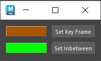

How to use
## AnimBuddy

#### Set Key Frame BTN
* Select the Color box next to the "Set Key Frame" button to change the color of your story telling keys.
* Pressing the "Set Key Frame" will place a story telling key or (when selecting a transition key) replace a transition key into a storytelling key.

#### Set Inbtween BTN
* Select the Color box next to the "Set Inbetween" button to change the color of your transitioning keys (like breakdowns and inbtweens).
* Pressing the "Set Inbetween" will place a transition key or (when selecting a story telling key) replace a story telling key into a transition key.
